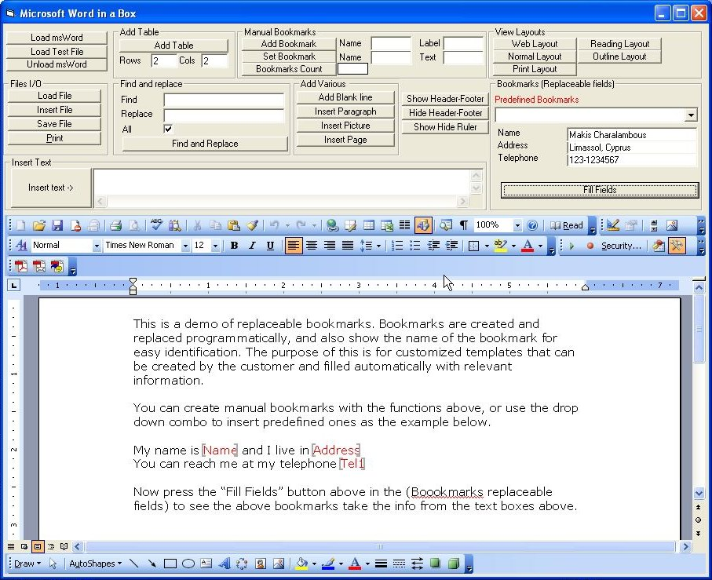



## MsWord in a Box \- msWord\.ocx \(Alpha Version\)

### Description

I always wanted to 'imprison' microsoft word and this is the execution of the sentense. I wanted word to reside inside an activex control and not run by itself. I also wanted full control of it and also use it as a report generator. Of cource you must have microsoft word 2000+ on your computer (Sorry for that, but we are going to IMPRISON it so feel a bit better). I have only tested this with word 2003 and I would like your feedback. First loading can be slow (Microsoft!!). This is the VERY first version (pre-alpha) and any comments will be highly appreciated. Forgive my dirty programming demo program but this is the work of a single day and I put effort on the control and not the demo. The concept is for word to live inside the Webbrowser control. You can create named bookmarks and replace them with values at runtime. This is the backbone for custom reports (or templates like reminding letters etc). You can insert pictures, files etc at will anywhere. You can toggle various things on-off. You can print, load and save documents in various formats (see code for 'Save File'). Click on the 'Load Test file' to test the predefined bookmarks. Also there is a technique to load files from the resource file (see code in the control). Well I hope that somebody out there wanted something like this. I wil keep on improving it as I need it in one of my projects (Radiologist reports with IC10 codes etc) but thought that I get some feedback from you while at it. If you care to vote then please leave a message as some sort of feedback that will help me in this project. Have fun and enjoy VB = Very Beautyful :)
 
### More Info
 

             |
---                |---
**Submitted On**   |2005-02-06 17:15:02
**By**             |[Makis Charalambous](https://github.com/Planet-Source-Code/PSCIndex/blob/master/ByAuthor/makis-charalambous.md)
**Level**          |Advanced
**User Rating**    |4.9 (74 globes from 15 users)
**Compatibility**  |VB 5\.0, VB 6\.0
**Category**       |[Custom Controls/ Forms/  Menus](https://github.com/Planet-Source-Code/PSCIndex/blob/master/ByCategory/custom-controls-forms-menus__1-4.md)
**World**          |[Visual Basic](https://github.com/Planet-Source-Code/PSCIndex/blob/master/ByWorld/visual-basic.md)
**Archive File**   |[MsWord\_in\_184914262005\.zip](https://github.com/Planet-Source-Code/makis-charalambous-msword-in-a-box-msword-ocx-alpha-version__1-58735/archive/master.zip)

